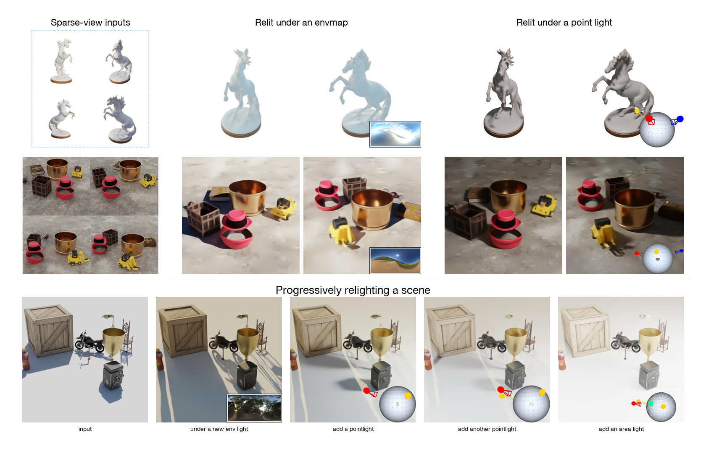
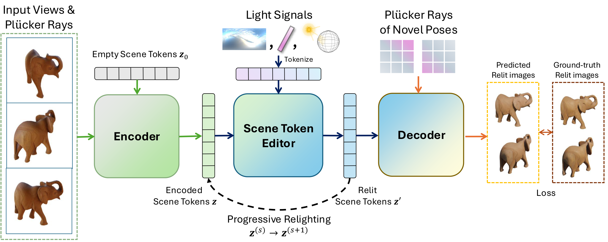

# LumiTokens: 3D Relighting via Token-Space Lighting Transformation

LumiTokens formulates 3D relighting as a direct transformation of latent scene
tokens. A Scene Token Editor jointly processes scene tokens and tokenized
lighting signals, producing an editable scene representation that can be
decoded into multi-view-consistent relit images and novel views.

<p align="center">
  
</p>

<p align="center"><em>LumiTokens supports novel-view relighting under diverse
light sources and composes successive lighting edits directly in token
space.</em></p>

## Links

- [Project page](https://neu-vi.github.io/LumiTokens)
- [Checkpoints and example data](https://drive.google.com/drive/folders/1hbCQBwag8FuhrM3abqpcvNT5s8EPJJL7?usp=sharing)

## Method Overview

LumiTokens contains three principal components:

1. A transformer encoder aggregates sparse posed images into a fixed set of
   latent scene tokens.
2. The Scene Token Editor updates those tokens using light-ray tokens derived
   from a target illumination signal.
3. A ray-conditioned decoder with a DPT head renders relit input or novel
   views from the edited scene tokens.

<p align="center">
  
</p>

<p align="center"><em>Architecture overview. Sparse posed views are encoded as
scene tokens, edited using tokenized environment, point, or area lighting, and
decoded at requested camera poses.</em></p>

Because edited tokens remain compatible with the decoder and editor, lighting
edits can be composed directly in token space before rendering.

## Quick Start

The quickstart uses the 256 x 256 MLP checkpoint and one scene from the
PolyHaven/LVSM example set. Four context views and eight target views are fixed
in `examples/quickstart_views_256.json` for reproducible output. Inference runs
on one CUDA GPU without `torchrun` or Slurm and has been tested on an NVIDIA RTX
A5000. The models were trained using eight NVIDIA A100 GPUs.

### 1. Create the environment

```bash
conda create -n lumitokens python=3.11 pip -y
conda activate lumitokens

python -m pip install --upgrade pip
python -m pip install \
  torch==2.4.1 \
  torchvision==0.19.1 \
  --index-url https://download.pytorch.org/whl/cu118
python -m pip install \
  xformers==0.0.28 \
  --index-url https://download.pytorch.org/whl/cu118
python -m pip install -r requirements.txt
```

### 2. Select and download a checkpoint

The pretrained checkpoints are distributed separately from the source code:

| Checkpoint | Decoder head | Resolution |
| --- | --- | ---: |
| `lumitokens_relight_256_mlp.pt` | MLP | 256 x 256 |
| `lumitokens_relight_512_mlp.pt` | MLP | 512 x 512 |
| `lumitokens_relight_512_dpt.pt` | DPT | 512 x 512 |

Download the selected checkpoint from the
[shared Google Drive folder](https://drive.google.com/drive/folders/1hbCQBwag8FuhrM3abqpcvNT5s8EPJJL7?usp=sharing),
then put it in the matching location under `checkpoints/mlp/` or
`checkpoints/dpt/`. Do not interchange MLP and DPT checkpoints: each must be
used with a config that constructs the corresponding decoder head.

### 3. Prepare the example data

Download the example dataset from the
[shared Google Drive folder](https://drive.google.com/drive/folders/1hbCQBwag8FuhrM3abqpcvNT5s8EPJJL7?usp=sharing)
and extract it so that this file exists:

```text
examples/polyhaven_lvsm_test/full_list.txt
```

### 4. Run the included example

```bash
bash scripts/infer_quickstart.sh
```

The equivalent explicit command is:

```bash
python -m lumitokens.infer \
  --config configs/relight_256_mlp.yaml \
  --checkpoint checkpoints/mlp/lumitokens_relight_256_mlp.pt \
  --data-root examples/polyhaven_lvsm_test \
  --scene-index 0 \
  --output outputs/quickstart
```

The command renders eight 256 x 256 target views. Results include the context
views, lighting inputs, ground-truth targets, predictions, a comparison grid,
and run metadata. The three rows of `comparison.png` show the source-lighting
views, relighting ground truth, and LumiTokens predictions.

## Checkpoints

Pretrained checkpoints are available from the
[LumiTokens Google Drive folder](https://drive.google.com/drive/folders/1hbCQBwag8FuhrM3abqpcvNT5s8EPJJL7?usp=sharing).
The 256 x 256 MLP checkpoint is the recommended model for the quickstart.

| Checkpoint | Decoder head | Resolution | Config | Download |
| --- | --- | ---: | --- | --- |
| `lumitokens_relight_256_mlp.pt` | MLP | 256 x 256 | `configs/relight_256_mlp.yaml` | [Google Drive](https://drive.google.com/drive/folders/1hbCQBwag8FuhrM3abqpcvNT5s8EPJJL7?usp=sharing) |
| `lumitokens_relight_512_mlp.pt` | MLP | 512 x 512 | `configs/relight_512_mlp.yaml` | [Google Drive](https://drive.google.com/drive/folders/1hbCQBwag8FuhrM3abqpcvNT5s8EPJJL7?usp=sharing) |
| `lumitokens_relight_512_dpt.pt` | DPT | 512 x 512 | `configs/relight_512_dpt.yaml` | [Google Drive](https://drive.google.com/drive/folders/1hbCQBwag8FuhrM3abqpcvNT5s8EPJJL7?usp=sharing) |

Place each downloaded checkpoint at the corresponding path below:

```text
checkpoints/
├── mlp/
│   ├── lumitokens_relight_256_mlp.pt
│   └── lumitokens_relight_512_mlp.pt
└── dpt/
    └── lumitokens_relight_512_dpt.pt
```

Use each checkpoint only with its matching config and decoder head.

## Input Data

LumiTokens reads one processed split at a time. `full_list.txt` contains one
metadata JSON path per line. Each JSON contains a `scene_name` and an ordered
`frames` array; every frame provides an image path, pixel-space intrinsics
`[fx, fy, cx, cy]`, and a 4 x 4 OpenCV-convention world-to-camera matrix.

```text
<data-root>/
├── full_list.txt
├── metadata/<scene_name>.json
├── images/<scene_name>/<view>.png
├── envmaps/<scene_name>/<view>_{hdr,ldr}.png
├── point_light_rays/<scene_name>.npy       # local-light scenes
└── albedos/<object_uid>/<view>.png         # optional
```

```json
{
  "scene_name": "<object_uid>_env_0",
  "frames": [
    {
      "image_path": "/absolute/path/to/images/<scene_name>/00000.png",
      "fxfycxcy": [512.0, 512.0, 256.0, 256.0],
      "w2c": [[1.0, 0.0, 0.0, 0.0], [0.0, 1.0, 0.0, 0.0], [0.0, 0.0, 1.0, 0.0], [0.0, 0.0, 0.0, 1.0]]
    }
  ]
}
```

Environment-lit scenes store camera-aligned HDR and LDR lighting images for
each frame. Point-, multi-point-, area-, and combined-light scenes store light
rays as `[N, 10]` NumPy arrays: intensity, RGB color, ray origin, and ray
direction. Images and processed lighting maps are PNG files; the preprocessing
stage reads source HDRIs from EXR or HDR files.

## Data Preparation

The repository includes two Blender-based renderers and the conversion pipeline
used to produce the model input format:

- `render_3dmodels_dense.sh` generates object-centric data with
  `render_3dmodels_dense_enhance.py`.
- `render_3dscenes_dense.sh` generates composed scene-level data with
  `render_3dscenes_dense.py`.
- `preprocess_train_full.sh` and `preprocess_test_full_pointLights.sh` convert
  raw renders into the layout above.

See [`docs/DATA_PREPARATION.md`](docs/DATA_PREPARATION.md) for dependencies,
asset layout, CSV format, full commands, lighting conventions, and provenance.

## Inference

LumiTokens inference runs on one CUDA GPU and does not require `torchrun` or a
Slurm environment. Before allocating the model on the GPU, the command validates
the configuration, dataset manifest, selected scenes, and checkpoint
architecture. Use a matching checkpoint and configuration from the
[Checkpoints](#checkpoints) table above.

### Relight a scene

```bash
python -m lumitokens.infer \
  --config configs/relight_256_mlp.yaml \
  --checkpoint checkpoints/mlp/lumitokens_relight_256_mlp.pt \
  --data-root examples/polyhaven_lvsm_test \
  --scene-index 0 \
  --output outputs/relighting
```

`--data-root` must contain a `full_list.txt` manifest. `--scene-index` selects a
scene after the configuration's lighting-type filters are applied. Without
`--all-frames`, the configuration controls context and target-view sampling.
Use `--seed` to reproduce the same selection.

### Render every dataset camera pose

```bash
bash scripts/render_example_video.sh
```

The equivalent explicit command is:

```bash
python -m lumitokens.infer \
  --config configs/relight_512_dpt.yaml \
  --checkpoint checkpoints/dpt/lumitokens_relight_512_dpt.pt \
  --data-root examples/polyhaven_lvsm_test \
  --scene-index 0 \
  --all-frames \
  --video \
  --num-input-views 10 \
  --view-chunk-size 1 \
  --fps 24 \
  --output outputs/example_video
```

With `--all-frames`, the command selects `--num-input-views` evenly spaced
conditioning views and renders every camera pose in dataset order. Target views
are decoded in chunks to bound GPU memory usage. Increase `--view-chunk-size`
for greater throughput when memory permits, or reduce it for smaller GPUs.

`--video` assembles `predicted.mp4` from the predicted frames and `lighting.mp4`
from the target lighting maps at the requested `--fps`. Omit `--video` to save
PNG frames only. To check the manifest, sample, configuration, and checkpoint
without running GPU inference, append `--validate-only` to either command.

### Output layout

Each run is stored under the source and target-lighting scene names. Frame
filenames use zero-padded dataset camera indices, keeping predictions, lighting
maps, targets, and metadata aligned.

```text
<output>/<source>__to__<lighting>/
├── context/<camera>.png                 # source-lit context views
├── source_target/<camera>.png           # optional source-lit target views
├── lighting/
│   ├── context/<camera>.png             # lighting at context cameras
│   └── target/<camera>.png              # lighting at rendered cameras
├── target/<camera>.png                  # relighting ground truth, when present
├── predicted/<camera>.png               # LumiTokens render sequence
├── comparison.png                       # selected-view runs with all three rows
├── predicted.mp4                        # with --video
├── lighting.mp4                         # with --video and environment lighting
└── metadata.json
```

`metadata.json` records the source and lighting scene names, config and
checkpoint paths, random seed, context and target camera indices, frame counts,
and generated video paths. `comparison.png` contains source-lighting target
views, relighting ground truth, and predictions; it is written only when all
three image sets are available.

## Training and Fine-Tuning

LumiTokens is trained coarse to fine: first learn the reconstruction model with
an MLP decoder head, then train the Scene Token Editor while retaining the MLP
head, and only then replace the readout with the DPT head. The final optional
stage fine-tunes the DPT model on composed scene-level data. Distributed runs
use `torchrun`; the examples below use eight A100 GPUs, matching the training
setup used for the released models.

### 1. Pre-train the reconstruction model

This stage follows `finetune_objaverse.sh`. It learns the scene encoder and
view-conditioned decoder without relighting supervision. The dataset manifest
should point to multi-view object renders prepared as described in
[`docs/DATA_PREPARATION.md`](docs/DATA_PREPARATION.md).

```bash
torchrun --nproc_per_node=8 --nnodes=1 \
  train.py --config configs/LVSM_scene_encoder_decoder_sparse.yaml \
  training.dataset_path=/path/to/reconstruction_data/train/full_list.txt \
  training.checkpoint_dir=checkpoints/training/reconstruction_mlp \
  training.batch_size_per_gpu=8 \
  training.grad_accum_steps=1
```

The resulting checkpoint initializes the encoder, decoder transformer, and MLP
image head used in the next stage.

### 2. Train the Scene Token Editor with the MLP head

This stage follows `relight_general_dense_lr1e4_singleMap.sh`. Start from the
reconstruction checkpoint and train on lighting variations of the same objects:

```bash
torchrun --nproc_per_node=8 --nnodes=1 \
  train_editor.py \
  --config configs/LVSM_scene_encoder_decoder_wEditor_general_dense.yaml \
  training.dataset_path=/path/to/polyhaven_lvsm/train/full_list.txt \
  training.LVSM_checkpoint_dir=checkpoints/training/reconstruction_mlp \
  training.checkpoint_dir=checkpoints/training/editor_mlp \
  training.relight_signals="[envmap,point_light]" \
  training.single_env_map=true \
  training.lr=0.0001 \
  training.warmup=3000 \
  training.batch_size_per_gpu=8
```

Keep the decoder head set to `mlp` throughout this stage. Do not point
`training.LVSM_checkpoint_dir` at an editor checkpoint: it specifically
initializes the reconstruction backbone. Use `training.resume_ckpt` when
continuing an editor run.

### Selecting the lighting data

Set `training.relight_signals` on the command line to control both dataset
filtering and which lighting tokenizer is constructed:

| Argument | Metadata scenes sampled | Lighting representation |
| --- | --- | --- |
| `training.relight_signals="[envmap]"` | `*_env_*`, `*_white_env_*` | Camera-aligned environment maps |
| `training.relight_signals="[point_light]"` | `*_white_pl_*`, `*_rgb_pl_*`, `*_multi_pl_*`, `*_area_*`, `*_combined_*` | Sampled local-light rays `[N, 10]` |
| `training.relight_signals="[envmap,point_light]"` | All of the above | Environment-map and local-light tokens; combined scenes may provide both |

Area lights deliberately use the `point_light` signal family: preprocessing
converts point, multi-point, and area lights to the same ray format
`[intensity, RGB, ray origin, ray direction]`. There is no separate `area`
value for `training.relight_signals`.

For local-light or mixed training, set the local-light sampling parameters as
well:

```bash
training.relight_signals="[envmap,point_light]" \
training.point_light_num_rays=1024 \
training.point_light_plucker_method=default_plucker \
model.point_light_tokenizer.in_channels=10
```

Related data-selection overrides are:

- `training.single_env_map=true`: randomly select one camera-aligned
  environment map instead of conditioning on every view's map.
- `training.whiteEnvInput=true`: use only `*_white_env_0` scenes as source
  images; this does not change the allowed target-light types.
- `training.exclude_white_env0_from_relit_sampling=true`: prevent the neutral
  white environment from being selected as the relighting target.

The object-centric dataset can be supplied as
`/path/to/polyhaven_lvsm/train/full_list.txt`. To incorporate the composed
scene data, add its prepared manifest—commonly
`/path/to/lvsm_scenes_dense/test/full_list.txt`—either as a comma-separated
second value in `training.dataset_path` or through
`training.extra_dataset_paths`.

### 3. Transfer from the MLP head to DPT

After the MLP editor converges, construct the model with `decoder_head.type=dpt`
and load the MLP editor checkpoint with non-strict head replacement. Compatible
encoder, decoder, and editor tensors are retained while the new multi-scale DPT
layers are initialized and optimized:

```bash
torchrun --nproc_per_node=8 --nnodes=1 \
  train_editor.py \
  --config configs/LVSM_scene_encoder_decoder_wEditor_general_dense_512_res_singleMap_dpt_transfer.yaml \
  training.dataset_path=/path/to/polyhaven_lvsm/train/full_list.txt \
  training.LVSM_checkpoint_dir=checkpoints/training/reconstruction_mlp_512 \
  training.resume_ckpt=checkpoints/training/editor_mlp/ckpt.pt \
  training.checkpoint_dir=checkpoints/training/editor_dpt \
  training.relight_signals="[envmap,point_light]" \
  training.reset_training_state=true \
  training.dpt_transfer.enabled=true \
  training.dpt_transfer.train_stage=auto \
  training.dpt_transfer.stage1_steps=5000 \
  training.dpt_transfer.freeze_backbone_in_stage1=true \
  training.dpt_transfer.stage2_unfreeze=all \
  training.dpt_transfer.backbone_lr_scale=0.1
```

With `train_stage=auto`, stage 1 warms up the DPT head while the backbone is
frozen; stage 2 jointly fine-tunes the requested backbone components. A common
high-resolution schedule first performs the DPT transfer at 256 x 256, then
sets the 256-DPT checkpoint as `training.resume_ckpt` for the 512 x 512 run.

### 4. Fine-tune on scene-level data

Resume from the object-centric DPT checkpoint and fine-tune with the
scene-level manifest. The established scene adaptation uses stage 2 with all
backbones unfrozen and a lower learning rate:

```bash
torchrun --nproc_per_node=8 --nnodes=1 \
  train_editor.py \
  --config configs/LVSM_scene_encoder_decoder_wEditor_general_dense_512_res_singleMap_dpt_transfer.yaml \
  training.dataset_path=/path/to/lvsm_scenes_dense/test/full_list.txt \
  training.resume_ckpt=checkpoints/training/editor_dpt/ckpt.pt \
  training.checkpoint_dir=checkpoints/training/editor_dpt_scene \
  training.relight_signals="[envmap,point_light]" \
  training.lr=0.00005 \
  training.reset_training_state=true \
  training.dpt_transfer.enabled=true \
  training.dpt_transfer.train_stage=stage2 \
  training.dpt_transfer.stage2_unfreeze=all \
  training.dpt_transfer.backbone_lr_scale=1.0
```

Choose the lighting selector according to the scene types present in the
manifest. In particular, mixed scene data containing environment, point,
multi-point, area, and combined illumination should use
`"[envmap,point_light]"`.

## Citation

If you use LumiTokens, please cite:

```bibtex
@inproceedings{chen2026lumitokens,
  title     = {LumiTokens: 3D Relighting via Token-Space Lighting Transformation},
  author    = {Chen, Yiwen and Gadelha, Matheus and Jiang, Huaizu},
  booktitle = {European Conference on Computer Vision},
  year      = {2026}
}
```

## License and Third-Party Software

Except where noted otherwise, this repository is released under
[CC BY-NC-SA 4.0](LICENSE). LumiTokens builds on LVSM and includes or adapts
components with their own attribution requirements. See
[THIRD_PARTY_NOTICES.md](THIRD_PARTY_NOTICES.md) and the headers of individual
files.

Model weights and datasets may use separate terms; consult the corresponding
model card or data documentation before use.

## Acknowledgements

LumiTokens builds on
[LVSM](https://github.com/haian-jin/LVSM). We thank the authors and contributors
of LVSM and the other projects listed in
[THIRD_PARTY_NOTICES.md](THIRD_PARTY_NOTICES.md).

## Contact

For questions and bug reports, please use the repository issue tracker. Report
security-sensitive matters privately as described in [SECURITY.md](SECURITY.md).
